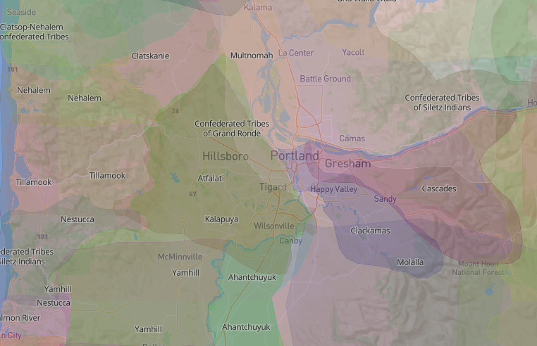

{: .highlight } Under construction for the Spring 2024 semester. Stay tuned!  

# Land Acknowledgement

As we come together to learn at Reed College, we acknowledge that the territory on which Reed stands is that of Indigenous and Native peoples. The Portland Metro area rests on traditional village sites of the Multnomah, Wasco, Cowlitz, Kathlamet, Clackamas, Bands of Chinook, Tualatin, Kalapuya, Molalla, and many other tribes who made their homes along the Columbia River (Portland Indian Leaders Roundtable, 2018).  Native lands have been taken through hundreds of breaches of treaty laws, and in 1953 more then sixty tribes in Oregon were terminated by the federal government which removed millions of acres of land from Indigenous stewardship ([The Native American Community in Multnomah County: An Unsettling Profile](https://www.portlandoregon.gov/civic/article/505489)). This statement is one small step in acknowledging the history that brought us to reside on this land.  Portland also has a vibrant and diverse Indigenous community and has the ninth largest urban Native American population in the US. We honor the present Indigenous communities in the area.  Visit [native-land.ca](https://native-land.ca/) to explore an interactive map of Indigenous lands.

_Screenshot from [native-land.ca](https://native-land.ca/)_
