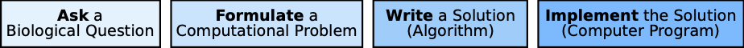

# Goals & Objectives

In Bio131, you will become familiar with how cells use molecules to transfer and process information, what types of biological questions about molecules can be investigated using computers, and what limitations computational methods impose on the understanding of biology. Additionally, you will learn about one application of sequence analysis (determining genetic relatedness) and how it has influenced society and culture.

Specifically, by the end of this course:

- You will know about the properties of DNA, RNA, and proteins, the relationships among these molecules, and some **biological questions** that have puzzled researchers.
- You will know how to convert a biological question into a **computational problem** that can be solved using computers.  
- You will know how to read and understand solutions to computational problems, which will be formalized as a series of tasks (an **algorithm**).  You will learn about general approaches for solving computational problems, and you will be able to apply these approaches to new problems you encounter.
- You will know how to implement the algorithms by writing **computer programs** in Python, which can be run and understood by others.
- You will learn about how genetic testing has influenced society and culture.

Bio131 is designed for you to pursue your own interests within the scope of these learning objectives. For this reason, you will be assessed by contract grading, which is designed to shift the power of the grade from the instructor to the student. More information about this grading assessment is provided in [XXX].
